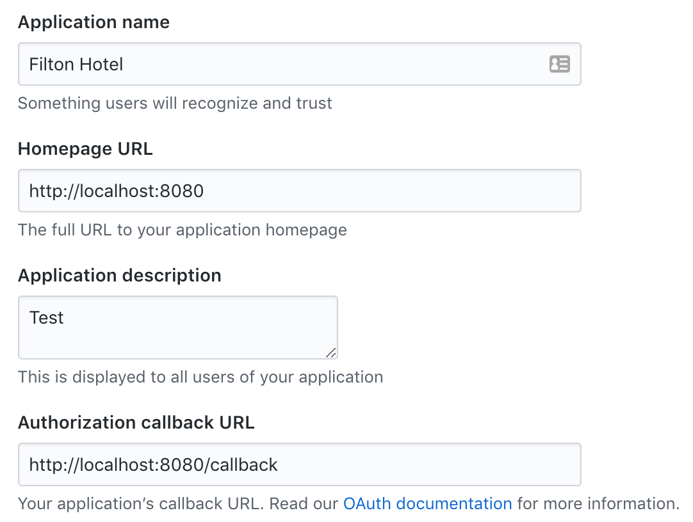

# About

This project is for students that can't get Cloud SDK working on their computers. Instead of running this web app on 
GAE, you can run it on your computer without the Cloud SDK (just right-click on main.py and select Run or type
`python main.py` in the Terminal).

Also run `pip install -r requirements.txt` to install the necessary libraries (**important**: peewee library is added to handle SQLite).

Instead of Google Datastore, this project uses SQLite (in a very simple way).

### GitHub Login

In order to create GitHub login, you must register your web app on GitHub first.

Do it via this URL: [https://github.com/settings/applications/new](https://github.com/settings/applications/new)

Fill out the form like this:

